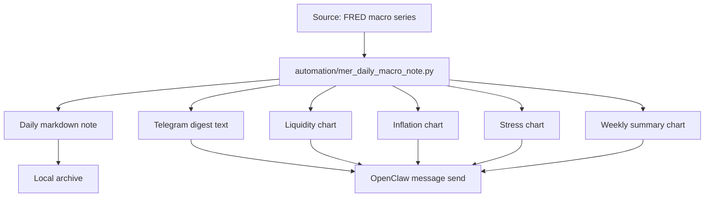
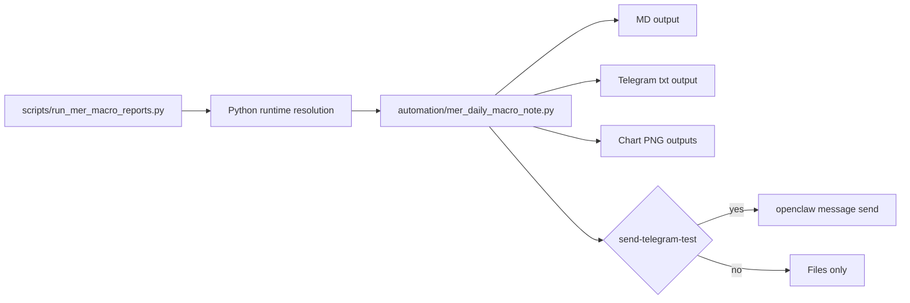

# mer-macro-system

메르 블로그식 해석 프레임으로 **일간/주간 매크로 리포트, 텔레그램용 브리핑 메시지, 모바일 가독성 최적화 차트**를 자동 생성하는 재사용 가능한 운영 패키지입니다.

이 저장소는 특정 OpenClaw 워크스페이스 전용 문서가 아니라,
**clone해서 다른 OpenClaw, Claude Code, Codex CLI 환경에서도 바로 가져다 쓸 수 있는 형태**를 목표로 정리되어 있습니다.

---

## 무엇을 해주나

이 시스템은 아래 흐름을 자동화합니다.

1. FRED 기반 핵심 매크로 지표 수집
2. 메르식 해석 문장 생성
3. Markdown 리포트 생성
4. 텔레그램용 짧은 브리핑 메시지 생성
5. 차트 이미지 생성
6. 필요 시 OpenClaw를 통해 텔레그램 발송

즉, 단순 숫자 수집기가 아니라
**메르식 매크로 브리핑 생성 엔진**에 가깝습니다.

---

## 누구에게 맞나

- 메르 블로그식 프레임으로 매일 시장을 읽고 싶은 사람
- 텔레그램에서 바로 읽히는 짧은 브리핑이 필요한 사람
- 매크로 리포트를 md + 차트 + 메신저까지 자동화하고 싶은 사람
- OpenClaw 외 다른 에이전트 환경에서도 같은 구조를 재사용하고 싶은 사람

---

## 핵심 산출물

### 일간
- `invest/notes/daily-macro/YYYY-MM-DD.md`
- `invest/notes/daily-macro/YYYY-MM-DD.telegram.txt`
- `invest/notes/daily-macro/charts/YYYY-MM-DD-liquidity-timeseries.png`
- `invest/notes/daily-macro/charts/YYYY-MM-DD-inflation-timeseries.png`
- `invest/notes/daily-macro/charts/YYYY-MM-DD-stress-timeseries.png`

### 주간
- `invest/notes/daily-macro/weekly/YYYY-Www.md`
- `invest/notes/daily-macro/weekly/YYYY-Www.telegram.txt`
- `invest/notes/daily-macro/charts/YYYY-MM-DD-weekly-key-changes.png`

---

## 현재 주요 지표

### Liquidity
- TGA (`WTREGEN`)
- RRP (`RRPONTSYD`)
- Reserve Balances (`WRESBAL`)

### Inflation
- CPI (`CPIAUCSL`)
- Core CPI (`CPILFESL`)
- PCE (`PCEPI`)
- Core PCE (`PCEPILFE`)

### Stress
- HY OAS (`BAMLH0A0HYM2`)

---

## 빠른 시작

### 1) clone
```bash
git clone https://github.com/dontotl/mer-macro-system.git
cd mer-macro-system
```

### 2) 가상환경 준비
```bash
python3 -m venv .venv
source .venv/bin/activate
pip install pandas matplotlib requests
```

### 3) 일간 리포트 생성
```bash
python scripts/run_mer_macro_reports.py --date 2026-04-29
```

### 4) 주간 포함 생성
```bash
python scripts/run_mer_macro_reports.py --date 2026-04-29 --weekly
```

### 5) OpenClaw 환경에서 텔레그램 테스트 발송
```bash
python scripts/run_mer_macro_reports.py \
  --date 2026-04-29 \
  --weekly \
  --send-telegram-test \
  --telegram-target <chat_id>
```

---

## 에이전트별 사용 방식

### OpenClaw
- 가장 자연스러운 사용 환경
- `openclaw message send`로 텔레그램 텍스트/이미지 발송 가능
- cron과 연결하면 완전 자동화 가능

### Claude Code / Codex CLI
- 리포트 생성, md 생성, 차트 생성까지는 바로 사용 가능
- 텔레그램 발송 부분은 OpenClaw가 없으면 비활성화하거나 별도 메신저 전송 로직으로 교체하면 됨
- 즉, **생성 엔진은 독립적이고, 전송은 OpenClaw 친화적**입니다

---

## 구조



---

## 실행 아키텍처



### 역할 구분
- `scripts/run_mer_macro_reports.py`
  - 실행 진입점
  - Python 경로 정리
  - 옵션 전달
- `automation/mer_daily_macro_note.py`
  - 실제 생성 엔진
  - 텍스트/차트/전송 로직 담당

---

## 텔레그램 메시지 포맷

현재 텔레그램 메시지는 모바일 가독성 중심으로 아래 구조를 사용합니다.

1. 한줄 결론
2. 큰 위치
3. 장기추세
4. 오늘 해석
5. 핵심 숫자

차트는 텔레그램에서 바로 읽히도록
- 한글 폰트 렌더링 수정
- 모바일용 대형 글씨
- 정보 박스 강화
를 반영했습니다.

---

## 설치/운영 문서

- 설치 안내: `docs/INSTALL.md`
- 사용/활용: `docs/USAGE.md`
- 스킬 설명: `SKILL.md`

---

## 한 줄 요약

이 저장소는 메르식 매크로 해석을
**수집 → 해석 → md → 텔레그램 → 차트 → 재사용 가능한 자동화**
까지 연결하는 실전 운영 패키지입니다.
