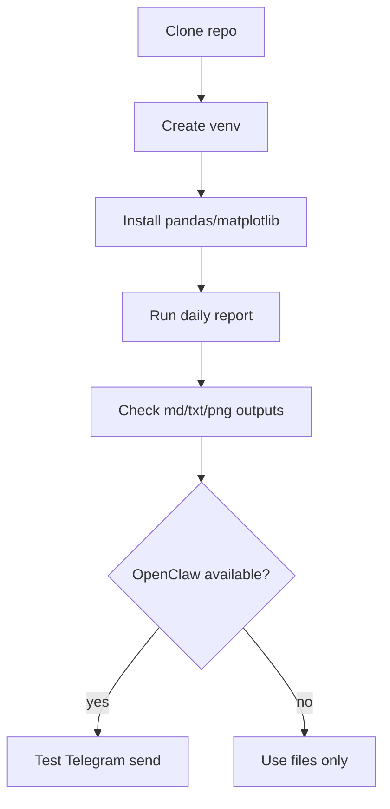

# INSTALL

이 문서는 `mer-macro-system` 저장소를 clone한 뒤,
**OpenClaw / Claude Code / Codex CLI 환경에서 실제 실행 가능한 상태로 만드는 방법**을 설명합니다.

---

## 1. 요구사항

### 필수
- Python 3.10+
- `pandas`
- `matplotlib`
- 인터넷 연결 (FRED 데이터 수집용)

### 선택
- OpenClaw CLI
  - 텔레그램 전송 테스트 및 자동 발송에 필요
- `gh`
  - GitHub 운영용

---

## 2. clone

```bash
git clone https://github.com/dontotl/mer-macro-system.git
cd mer-macro-system
```

---

## 3. 가상환경 준비

### 일반 Python venv 예시
```bash
python3 -m venv .venv
source .venv/bin/activate
pip install --upgrade pip
pip install pandas matplotlib requests
```

### OpenClaw 운영 환경 예시
이미 별도 운영 가상환경이 있다면 그 환경을 그대로 써도 됩니다.
예: `./.venv-mer-dashboard/bin/python`

---

## 4. 기본 실행 확인

### 일간 리포트 생성
```bash
python scripts/run_mer_macro_reports.py --date 2026-04-29
```

### 주간 포함 생성
```bash
python scripts/run_mer_macro_reports.py --date 2026-04-29 --weekly
```

생성이 끝나면 아래 파일들이 생겨야 합니다.

- `invest/notes/daily-macro/2026-04-29.md`
- `invest/notes/daily-macro/2026-04-29.telegram.txt`
- `invest/notes/daily-macro/charts/2026-04-29-liquidity-timeseries.png`
- `invest/notes/daily-macro/charts/2026-04-29-inflation-timeseries.png`
- `invest/notes/daily-macro/charts/2026-04-29-stress-timeseries.png`

---

## 5. OpenClaw에서 텔레그램 전송 테스트

OpenClaw가 설치/로그인된 환경이면 아래처럼 실제 전송까지 확인할 수 있습니다.

```bash
python scripts/run_mer_macro_reports.py \
  --date 2026-04-29 \
  --weekly \
  --send-telegram-test \
  --telegram-target <chat_id>
```

### 참고
- 이 전송은 내부적으로 `openclaw message send`를 사용합니다.
- OpenClaw가 없는 환경에서는 리포트/차트 생성까지만 사용하면 됩니다.

---

## 6. Claude Code / Codex CLI에서 쓰는 법

이 저장소는 특정 에이전트에 강하게 묶여 있지 않습니다.

### 그대로 가능한 것
- md 생성
- telegram txt 생성
- 차트 png 생성
- 리포트 로직 수정

### OpenClaw가 있을 때만 가능한 것
- `--send-telegram-test` 기반 실제 텔레그램 발송
- OpenClaw cron 자동화

즉,
**생성 엔진은 독립적이고, 전송/자동화는 OpenClaw 친화적**입니다.

---

## 7. 한글 폰트 렌더링

차트에는 한글 텍스트가 들어가므로, macOS 기준 아래 폰트 중 하나를 자동 탐색합니다.

- `Apple SD Gothic Neo`
- `NanumGothic`
- `AppleGothic`
- `Malgun Gothic`

별도 설정 없이도 대부분 해결되지만,
폰트가 없는 환경에서는 시스템 한글 폰트를 추가로 설치해야 할 수 있습니다.

---

## 8. 보안/운영 주의사항

### 커밋하지 말 것
- `.env`
- 토큰/secret 파일
- 개인 채팅 ID 목록 전체
- 개인 워크스페이스 메모/메모리 파일

### 권장
- 인증은 환경변수 또는 CLI 로그인 상태로 처리
- 운영 자동화는 repo 외부 비밀 저장소/런타임 설정으로 관리

---

## 9. 추천 운영 구조



---

## 10. 설치 한 줄 요약

1. clone
2. venv 준비
3. `pandas`, `matplotlib` 설치
4. 일간/주간 생성 확인
5. OpenClaw가 있으면 텔레그램 테스트

이렇게 하면 바로 운영 가능한 상태가 됩니다.
