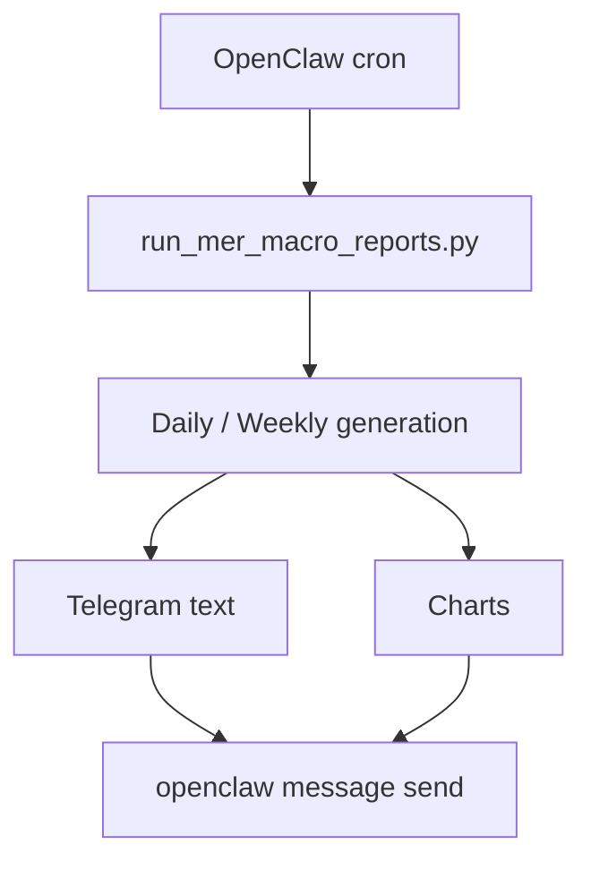
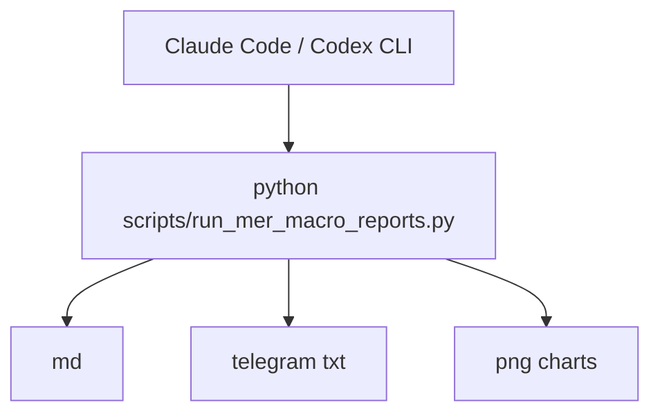

# USAGE

이 문서는 `mer-macro-system`을 **실제로 어떻게 운영하면 좋은지** 설명합니다.

---

## 1. 언제 쓰면 좋은가

이 저장소는 아래 같은 상황에 잘 맞습니다.

- 매일 아침 매크로 브리핑을 받고 싶다
- 메르식 프레임으로 시장 위치와 추세를 빠르게 읽고 싶다
- md 기록과 텔레그램 브리핑을 같이 남기고 싶다
- OpenClaw 외 다른 에이전트에서도 같은 구조를 재사용하고 싶다

---

## 2. 기본 실행 예시

### 일간
```bash
python scripts/run_mer_macro_reports.py --date 2026-04-29
```

### 일간 + 주간
```bash
python scripts/run_mer_macro_reports.py --date 2026-04-29 --weekly
```

### 텔레그램 테스트 포함
```bash
python scripts/run_mer_macro_reports.py \
  --date 2026-04-29 \
  --weekly \
  --send-telegram-test \
  --telegram-target <chat_id>
```

---

## 3. 결과물은 어떻게 읽나

### Markdown 리포트
- 더 자세한 기록용
- 지표별 설명과 해석 확인용
- 일간/주간 회고용

### Telegram 텍스트
- 모바일 브리핑용
- 현재 포맷:
  1. 한줄 결론
  2. 큰 위치
  3. 장기추세
  4. 오늘 해석
  5. 핵심 숫자

### 차트
- 텔레그램 가독성에 맞춘 대형 글씨 버전
- 현재 핵심 차트:
  - Liquidity
  - Inflation
  - Stress

---

## 4. 추천 운영 방식

### A. OpenClaw 자동화 운영
- cron으로 아침 고정 시간 실행
- 텔레그램 자동 발송
- md는 로컬 아카이브 유지



### B. Claude Code / Codex CLI 수동 운영
- 필요할 때 리포트 생성
- 결과 파일 확인
- 메신저 전송은 별도 처리



### C. 리서치 아카이브 운영
- 매일 md를 쌓아두고
- 특정 시기 비교
- 전략 판단 기록과 연결

---

## 5. 텔레그램 메시지 해석법

현재 텔레그램 메시지는 길게 설명하기보다,
**시장 위치 + 방향 + 행동 해석**이 먼저 보이도록 설계되어 있습니다.

예를 들어:
- 유동성: 중간 이하
- 물가: 중간 이상
- 스트레스: 안정

이런 구조는 숫자를 다 외우지 않아도,
**지금 시장이 편한지 불편한지**를 바로 읽게 해줍니다.

핵심 숫자의 `최근 3년 위치`는 보조 지표입니다.
즉,
- 위치감 파악용으로는 좋지만
- 단독 판단 기준이 아니라
- 추세/임계값/메르식 해석과 같이 봐야 합니다.

---

## 6. 다른 에이전트에서 재사용할 때

### OpenClaw
- 텔레그램 발송까지 가장 자연스럽게 연결됨
- cron 자동화 쉬움
- SKILL.md 기반 운영 적합

### Claude Code
- 문서/코드 수정, 리포트 생성, 차트 개선에 적합
- 텔레그램 전송은 OpenClaw 없이 바로 안 붙을 수 있음

### Codex CLI
- 로컬 자동화/스크립트 수정/리포트 생성 작업에 적합
- 역시 전송은 OpenClaw가 있으면 더 편함

즉,
**어느 에이전트든 생성은 가능하고, OpenClaw가 있으면 전송/자동화가 완성**됩니다.

---

## 7. 운영 팁

### 팁 1. 텔레그램은 짧게 유지
모바일에서 잘 읽히는 게 핵심이라,
텍스트는 짧고 차트는 크게 가는 편이 좋습니다.

### 팁 2. md는 설명용으로 남기기
텔레그램에서 다 설명하려 하지 말고,
깊은 해석은 md에 남기는 구조가 좋습니다.

### 팁 3. 차트는 적게, 크게
많은 차트보다
- Liquidity
- Inflation
- Stress
세 장 정도가 가장 읽기 좋습니다.

### 팁 4. weekly는 맥락용
데일리는 체크,
주간은 방향성 해석용으로 쓰는 게 맞습니다.

---

## 8. 앞으로 확장하기 좋은 방향

- Policy / Repo 축 복원 또는 고도화
- 월간/분기 리포트 추가
- 자산배분/시장 코멘트 연동
- Notion/Obsidian 저장 연동
- 텔레그램 외 다른 메신저 포맷 추가

---

## 9. 한 줄 요약

이 저장소는 메르식 매크로 해석을
**읽기 쉬운 브리핑으로 자동 생성하고, 다른 에이전트 환경에서도 재사용할 수 있게 만든 운영 도구**입니다.
